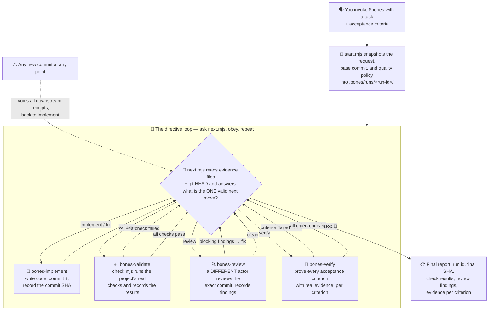
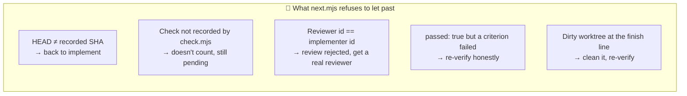

# Bones

**A quality workflow for AI coding agents that is literally just skills.** No CLI to install, no server, no database, no accounts. You copy five folders of markdown (plus three tiny Node scripts) into your agent's skills directory, say `$bones`, and your agent stops being able to say "done!" without proving it.

## ELI5 — what is this?

You know how an AI agent will happily write some code, run half a test, and declare victory? Bones is the adult in the room.

Think of it like a **board game where the agent can't move without rolling the dice**:

- The **dice** is a tiny script (`next.mjs`) that looks at what's actually on disk — real files, real Git commits — and says "your one and only next move is X."
- The **board squares** are five phases: implement → validate → review → verify → stop.
- The **rulebook** is five skills (markdown files) that tell the agent exactly how to play each square.
- The **receipts** are JSON evidence files, each stamped with the exact Git commit they prove something about.

The agent never gets to decide "I think I'm done" from memory. It has to ask the script, and the script only believes files and Git. Change one line of code after review? Every downstream receipt is instantly void and you're back on the implement square. Try to review your own code? Rejected — the reviewer must be a different actor. Claim verification passed while a criterion failed? The script reads the receipt and sends you back.

That's the whole trick: **the workflow can't drift, because it's never remembered — it's recomputed from disk every single step.**

## Install

```bash
npx skills add salmanrrana/bones --all
```

That installs all five skills into your agent's skills directory (works with Claude Code, Cursor, Codex, OpenCode, and anything else that reads Agent Skills). Prefer picking manually? `npx skills add salmanrrana/bones --list`.

Manual install is just a file copy:

```bash
cp -r skills/* .agents/skills/        # project-local
cp -r skills/* ~/.agents/skills/      # or user-wide
```

Requirements: **Node.js 24+** and **Git** on PATH. That's it — the scripts run in place, nothing gets built or installed globally.

## Use

Bones is strictly opt-in. It only activates when you name it:

> Run this through **$bones**: fix the login timeout. Acceptance criteria: session survives 30 minutes idle; the auth tests pass.

Ordinary requests without `$bones` never trigger the workflow.

## The flow



And the gates that make it honest:



## What's actually in the box

```text
skills/bones            🎲 The router: init, start/resume, the loop, stop report
  └── scripts/          start.mjs · next.mjs · check.mjs · state.mjs (zero deps)
skills/bones-implement  🔨 How to play the implement/fix square
skills/bones-validate   ✅ How to play the validate square
skills/bones-review     🔍 How to play the review square (independence rules)
skills/bones-verify     🧪 How to play the verify square (evidence rules)
docs/                   Spec, architecture, state format, platform support
scripts/                Repo-side validator (development only)
```

All run state lives in your project under Git-ignored `.bones/`:

```text
.bones/
  workflow.json                 your policy: which checks, what blocks, how strict
  runs/<run-id>/
    run.json                    the frozen snapshot: request + policy + base SHA
    implementation.json         "here's the commit I made" 🧾
    checks/<id>.json            "here's what really happened when the check ran" 🧾
    review.json                 "here's what an independent reviewer found" 🧾
    verification.json           "here's proof for each acceptance criterion" 🧾
```

Every receipt is plain JSON you can read, diff, and audit. Every receipt names the exact Git SHA it certifies.

## Honest fine print

Bones makes cheating **detectable, not impossible**. The phase order, SHA binding, actor independence, and criterion coverage are computed by script — an agent following the loop cannot skip a gate. But "don't hand-edit the receipts" is an instruction, not cryptography. If you need tamper-proof enforcement against an adversarial agent, you need a stateful backend, which is exactly what Bones deliberately isn't. See [docs/product-spec.md](docs/product-spec.md#enforcement-model--honest-boundaries) for the full three-tier breakdown.

## Development

```bash
node scripts/validate-skills.mjs   # validates all 5 skills + runs the full lifecycle
                                   # (including the cheat attempts) in a temp repo
```

No dependencies, no install step. CI runs the same script on Linux, macOS, and Windows with Node 24 and 26.

More detail: [product spec](docs/product-spec.md) · [architecture](docs/architecture.md) · [state format](docs/state-format.md) · [platform support](docs/platform-support.md)
