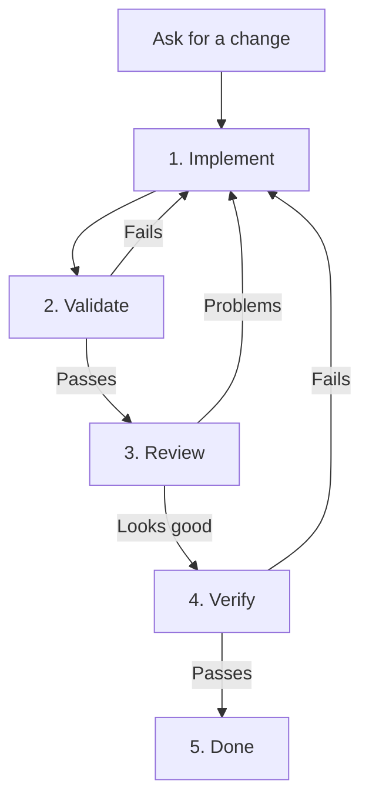

# 🦴 Bones

Bones gives AI coding work a clear structure. The AI does the work; Bones keeps it in the right order and makes sure it is checked before it is called done.

## Install

```bash
npx skills add salmanrrana/bones --all
```

This installs the Bones skills for your coding agent. Bones requires Node.js 24+ and Git.

## Use it

Mention `$bones` when you ask for a task:

> Run this through `$bones`: add a function that calculates 2 + 2. It must return 4 and the tests must pass.

Without `$bones`, nothing changes about the agent's normal workflow.

## How it works

Bones moves every task through four checks before it is done:

1. **Implement** — write the code.
2. **Validate** — run the configured tests and checks.
3. **Review** — have a different actor inspect the change.
4. **Verify** — prove that every requirement works.
5. **Done** — report the result.



For the 2 + 2 example:

- the agent adds the function;
- the tests run;
- a different actor reviews the change;
- the agent calls the function and proves it returns `4`;
- Bones reports that the task is done.

If the code changes later, the checks start again. Old results only prove that the old Git commit worked.

## The five skills

```text
bones            controls the workflow and chooses the next step
bones-implement  writes or fixes the code
bones-validate   runs the configured checks
bones-review     records the independent review
bones-verify     records proof for each requirement
```

Bones stores readable evidence files under `.bones/`. There is no CLI, server, database, or required account.

## Development

```bash
node scripts/validate-skills.mjs
```

More detail: [product spec](docs/product-spec.md) · [architecture](docs/architecture.md) · [state format](docs/state-format.md) · [platform support](docs/platform-support.md)
